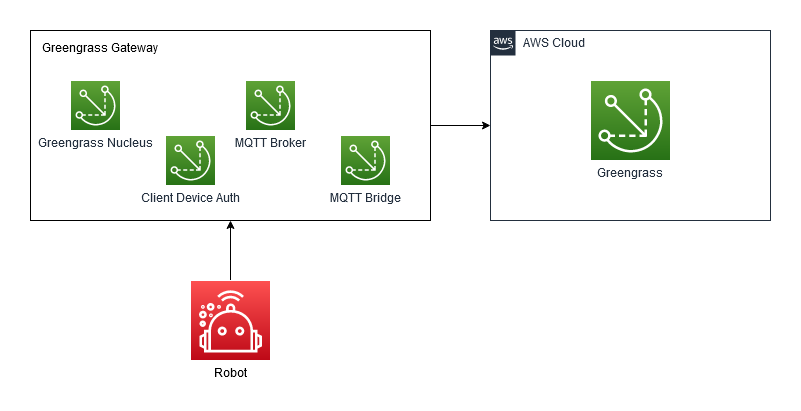

# Connect ROS2 robots to AWS Greengrass v2 server as client devices

## Sample application walkthough

Learn how to use a Greengrass deployment as a gateway server, including client device authentication and MQTT broker features. Greengrass is configured to accept client device connections from ROS2 robots. This code was tested on an [Ubuntu 22.04](https://www.releases.ubuntu.com/22.04/) system on [ROS2 Humble](https://docs.ros.org/en/humble/index.html).

This guide follows on from the [ROS2 Robot Connectivity Sample Application](https://github.com/aws-samples/aws-iot-robot-connectivity-samples-ros2). All of the tools and resources will be required from the MQTT sample application, including the AWS CLI with credentials and the IoT Thing and accompanying X.509 certificate.

Many of the environment variables will also be reused. Run the following commands to ensure that the variables are still set:

```bash
echo "Certificate folder: ${CERT_FOLDER_LOCATION}"
echo "IoT Config file: ${IOT_CONFIG_FILE}"
echo "AWS Region: ${AWS_REGION}"
echo "IoT Thing Name: ${THING_NAME}"
echo "IoT Thing ARN: ${THING_ARN}"
echo "IoT Certificate ARN: ${CERT_ARN}"
```

### Greengrass Setup

This setup is to demonstrate the use of Greengrass on a hub device allowing connections to a number of client devices. This is simulated using Docker containers to disconnect the client devices from the internet.


The lower left robots represent the client devices that are connecting to a central gateway. The gateway has software deployed to it using Greengrass, and bridges the connection between the robots and the cloud.

To use Docker, follow the installation instructions found [here](https://docs.docker.com/engine/install/ubuntu/). Docker must be run without `sudo` to make sure that environment variables are used correctly, so ensure to follow the [Linux postinstall](https://docs.docker.com/engine/install/linux-postinstall/) steps from the previous link.

<<<<<<< HEAD
Docker Compose is also used, which can be installed as follows:

```bash
sudo apt install -y docker-compose
=======
Docker Compose and `jq` are also used, which can be installed as follows:

```bash
sudo apt install -y docker-compose jq
>>>>>>> main
```

Clone the repository into the home directory as follows:

```bash
<<<<<<< HEAD
export REPO="$HOME/git/aws-iot-greengrass-client-devices-ros2"
git clone --recurse-submodules https://github.com/aws-samples/aws-iot-greengrass-client-devices-ros2.git $REPO
=======
export REPO="$HOME/git/aws-iot-greengrass-to-ros2-client-device-connection"
git clone --recurse-submodules https://github.com/aws-samples/aws-iot-greengrass-to-ros2-client-device-connection.git $REPO
>>>>>>> main
```

Once this is complete, a new configuration file must be created similar to the previous IoT config file. Execute the following steps:

```bash
export IOT_DOCKER_CONFIG_FILE="$CERT_FOLDER_LOCATION/iot_docker_config.json"
cat $IOT_CONFIG_FILE > $IOT_DOCKER_CONFIG_FILE
sed -i "s|$CERT_FOLDER_LOCATION|/workspace/iot_certs_and_config/|g" "$IOT_DOCKER_CONFIG_FILE"
cat $IOT_DOCKER_CONFIG_FILE
```

The certificates folder is required for configuring the Docker containers on all runs, so it is recommended to write the environment variable into your shell configuration file for future use:

```bash
echo "export CERT_FOLDER_LOCATION=$CERT_FOLDER_LOCATION" >> ~/.bashrc
source ~/.bashrc
```

This ensures that any future bash session will still have this environment variable available.

### Greengrass Configuration

There are a few steps to configure Greengrass as a hub for the client devices, which will be detailed below. At a high level, the steps are as follows:

1. Ensure a Greengrass service role is available.
2. Write the configuration for the Greengrass Nucleus software.
3. Write the credentials that Greengrass will use for creating its Thing.
4. Start Greengrass in a new terminal for first-time installation.
5. Write the configuration for the Greengrass components to be deployed.
6. Use the component configuration to create a deployment for Greengrass.
7. Wait for the deployment to complete on the Greengrass core.
8. Configure the client device to have permission to discover the Greengrass core.
9. Associate the IoT Thing as a client device of the Greengrass Thing.
10. Configure network and MQTT broker address.

After this, the Greengrass container will be fully configured and can be shut down ready to test the sample application.

#### Greengrass Service Role Configuration

Follow instructions [here](https://docs.aws.amazon.com/greengrass/v2/developerguide/connect-client-devices.html#configure-service-role-requirement) to ensure that Greengrass has a valid service role for execution.

#### Greengrass Nucleus Configuration 

The Greengrass Docker container can provision the Thing and Thing Group automatically, but it must be given particular details. To provide these, copy the `greengrass_template.env` file from the `templates` folder in this repository into `client_device_workspace/greengrass.env`, then modify the variables in the new file. Or, run the following commands to accomplish the same:

```bash
export GG_THING_NAME=MultiClientGreengrassCore
export GG_THING_GROUP_NAME=MultiClientGreengrassCoreGroup
export GREENGRASS_ENV_TEMPLATE="$REPO/templates/greengrass_template.env"
export GREENGRASS_ENV_FILE="$REPO/client_device_workspace/greengrass.env"
cat $GREENGRASS_ENV_TEMPLATE > $GREENGRASS_ENV_FILE
sed -i -e "s/MY_THING_NAME/$GG_THING_NAME/g" $GREENGRASS_ENV_FILE
sed -i -e "s/MY_THING_GROUP/$GG_THING_GROUP_NAME/g" $GREENGRASS_ENV_FILE
sed -i -e "s/MY_REGION/$AWS_REGION/g" $GREENGRASS_ENV_FILE
cat $GREENGRASS_ENV_FILE
```

This will allow Greengrass to provision a new Thing and Thing Group, or find it if it exists already.

#### Greengrass Credentials (Optional)

If provision is set to True in the environment variables, Greengrass requires access keys to provision. However, if provision is set to False, the user can manually create the Thing and Thing Group.

If access keys are required, they must be created and downloaded from the AWS console. Copy the file `templates/greengrass_credentials_template` to `client_device_workspace/greengrass-v2-credentials/credentials`, then modify the file to contain the access key details. The file should contain these variables:

```
[default]
aws_access_key_id=
aws_secret_access_key=
```

#### Start the Greengrass Container

**Warning: if the same terminal is used, some variables that have been set so far will become unavailable. Be careful to open a new terminal.**

Start Greengrass by itself to provision the Thing and Group, and install the Greengrass Nucleus. This should be done by opening a new terminal and executing:

```bash
cd "$REPO/client_device_workspace/"
docker-compose up greengrass
```

Wait until the logs show that the Nucleus has started. The logs showing that the Nucleus has started look similar to the following:

```log
...
greengrass_1  | Nucleus options: --setup-system-service false
greengrass_1  | + trap 'echo Received SIGTERM; sigterm_received=1; kill -TERM ${child_pid}; wait ${child_pid}; echo Killed child PID' TERM
greengrass_1  | + child_pid=11
greengrass_1  | + wait 11
greengrass_1  | + java -Dlog.store=FILE -Dlog.level= -Dlog.store=FILE -Droot=/greengrass/v2 -jar /greengrass/v2/alts/current/distro/lib/Greengrass.jar --setup-system-service false
greengrass_1  | Launching Nucleus...
greengrass_1  | Launched Nucleus successfully.
```

Leave the container running, as the next steps will deploy software to the container.

#### Greengrass Deployment

The Greengrass deployment is the process of deploying components to the Greengrass core device. In our case, this is the Greengrass container we just launched. The deployment lists the components to be deployed and the configuration for each component. Our deployment will use the following components:



1. Greengrass Nucleus - the core software for managing deployments
2. Client Device Auth - component allowing client devices to authenticate. We configure this to allow our IoT core device to authenticate, and set its permissions.
3. Moquette - the MQTT broker to run on the Greengrass device.
4. MQTT bridge - the component to bridge the MQTT link between the Greengrass device and the broker in the cloud. We configure this to allow our ROS topics to be forwarded to the cloud.

In this list, two of the components require configuration. The client device configuration can be created using the following template:

```json
{
  "deviceGroups": {
    "formatVersion": "2021-03-05",
    "definitions": {
      "MyDeviceGroup": {
        "selectionRule": "thingName: UNKNOWN",
        "policyName": "MultiClientDevicePolicy"
      }
    },
    "policies": {
      "MultiClientDevicePolicy": {
        "AllowConnect": {
          "statementDescription": "Allow client devices to connect.",
          "operations": [
            "mqtt:connect"
          ],
          "resources": [
            "*"
          ]
        },
        "AllowPublish": {
          "statementDescription": "Allow client devices to publish to all topics.",
          "operations": [
            "mqtt:publish"
          ],
          "resources": [
            "*"
          ]
        },
        "AllowSubscribe": {
          "statementDescription": "Allow client devices to subscribe to all topics.",
          "operations": [
            "mqtt:subscribe"
          ],
          "resources": [
            "*"
          ]
        }
      }
    }
  }
}
```

This template allows Things matching the selection rule to connect, publish, and subscribe to all topics. The topic is restricted further by the MQTT permissions. If more than one client device is required, use OR to join them together; for example, `ThingName1 OR ThingName2 OR ThingName3`.

<<<<<<< HEAD
=======
Information on more configuration options can be found [here](https://docs.aws.amazon.com/greengrass/v2/developerguide/client-device-auth-component.html#client-device-auth-component-configuration), which allows more restrictive access control depending on your use case.

**NOTE: Here we allow all client devices and topics for demonstration purposes only; the policy should be updated for use in production per your functional and security requirements.**

>>>>>>> main
The template should be copied from this file or from `templates/client_device_auth_template.json` into `$CERT_FOLDER_LOCATION/client_device_auth.json`. Following this, the UNKNOWN value should be updated with the IoT Thing name. This can be accomplished with the following:

```bash
export CLIENT_DEVICE_AUTH_TEMPLATE="$REPO/templates/client_device_auth_template.json"
export CLIENT_DEVICE_AUTH_FILE="$CERT_FOLDER_LOCATION/client_device_auth.json"
cat $CLIENT_DEVICE_AUTH_TEMPLATE > $CLIENT_DEVICE_AUTH_FILE
sed -i -e "s/UNKNOWN/$THING_NAME/g" $CLIENT_DEVICE_AUTH_FILE
cat $CLIENT_DEVICE_AUTH_FILE
```

This configuration can now be inserted into the Greengrass deployment configuration. The configuration looks like this:

```json
{
  "aws.greengrass.Nucleus": {
    "componentVersion": "2.9.5"
  },
  "aws.greengrass.clientdevices.Auth": {
    "componentVersion": "2.3.2",
    "configurationUpdate": {
      "merge": "UNKNOWN"
    }
  },
  "aws.greengrass.clientdevices.mqtt.Moquette": {
    "componentVersion": "2.3.1"
  },
  "aws.greengrass.clientdevices.mqtt.Bridge": {
    "componentVersion": "2.2.4",
    "configurationUpdate": {
      "merge": "{\"mqttTopicMapping\": {\"ForwardAllMapping\": {\"topic\": \"MY_TOPIC\",\"source\": \"LocalMqtt\",\"target\": \"IotCore\"} } }"
    }
  }
}
```

Here, the UNKOWN value of the Client Device Auth component must be updated with the newly created template. In addition, the MQTT Bridge component requires the MY_TOPIC field to be updated with the required topic name. All configurations in the deployment must be valid strings containing escaped JSON. This can be done by hand or by executing the following:

```bash
export TOPIC_NAME=ros2_mock_telemetry_topic
# Use jq to serialize JSON, then remove start quote, then end quote, then newline chars, then multiple spaces in a row. Then double-escape quotes for re-inserting into file.
export GG_AUTH_CONFIG=$(jq -Rs '.' "$CLIENT_DEVICE_AUTH_FILE" | sed 's/^"//' | sed 's/"$//' | sed 's/\\n//g' | sed -r 's/\s+/ /g' | sed 's/\\"/\\\\"/g')
<<<<<<< HEAD
=======
echo "Greengrass Auth config: $GG_AUTH_CONFIG"
>>>>>>> main

export DEPLOYMENT_CONFIG_TEMPLATE="$REPO/templates/greengrass_deployment_config_template.json"
export DEPLOYMENT_CONFIG_FILE="$REPO/client_device_workspace/greengrass_deployment_config.json"
cat $DEPLOYMENT_CONFIG_TEMPLATE > $DEPLOYMENT_CONFIG_FILE
sed -i "s/UNKNOWN/$GG_AUTH_CONFIG/g" $DEPLOYMENT_CONFIG_FILE
sed -i "s/MY_TOPIC/$TOPIC_NAME/g" $DEPLOYMENT_CONFIG_FILE
cat $DEPLOYMENT_CONFIG_FILE
```

Once this is complete, the Greengrass deployment is ready to be created in the cloud.

#### Create Greengrass Deployment

The deployment configuration file can now be used for deploying to Greengrass. Execute the following commands:

```bash
export GG_ARN=$(aws iot describe-thing --thing-name $GG_THING_NAME --query thingArn | tr -d '"')
aws greengrassv2 create-deployment --target-arn $GG_ARN --components "file://$DEPLOYMENT_CONFIG_FILE"
```

This command tells Greengrass that the Greengrass Core device has a new deployment, causing it to update itself with the new components and configuration.

Monitor the AWS console to check that the deployment has completed successfully. This can be done by opening the Greengrass page, as follows:


Select the Deployments on the left navigation bar:


This shows the list of deployments. Watch the status of the deployment for your Greengrass device, as shown by the lower colored box. More frequent refreshing can be performed by clicking the refresh arrow of the table, shown by the upper colored box.


Once the deployment is complete, the Greengrass container can be closed by selecting its terminal and pressing Ctrl+C.

#### Authorize Discovery for Client Devices

We must now configure the cloud to allow the client device to discover the Greengrass device. The policy template looks like the following:

```json
{
  "Version": "2012-10-17",
  "Statement": [
    {
      "Effect": "Allow",
      "Action": [
        "greengrass:Discover"
      ],
      "Resource": [
        "THING_ARN"
      ]
    }
  ]
}
```

Copy the above policy template or the file `templates/client_device_policy_template.json` into `$CERT_FOLDER_LOCATION/client_device_policy.json`, then replacing `THING_ARN` with the IoT Thing ARN. The Thing ARN can be looked up from the AWS Console. This file is used to determine whether the specified client device is allowed to perform Greengrass discovery, and which devices it should be allowed to discover.

```bash
export CLIENT_DEVICE_POLICY_TEMPLATE="$REPO/templates/client_device_policy_template.json"
export CLIENT_DEVICE_POLICY_FILE="$CERT_FOLDER_LOCATION/client_device_policy.json"
cat $CLIENT_DEVICE_POLICY_TEMPLATE > $CLIENT_DEVICE_POLICY_FILE
sed -i -e "s|THING_ARN|$THING_ARN|g" $CLIENT_DEVICE_POLICY_FILE
cat $CLIENT_DEVICE_POLICY_FILE
```

This policy may now be used to create an IAM policy in the cloud, and attach it to the existing IoT Thing's certificate. Use the following commands to accomplish this.

```bash
export CLIENT_DEVICE_POLICY_NAME=ros2_client_devicy_policy
aws iot create-policy --policy-name $CLIENT_DEVICE_POLICY_NAME --policy-document file://$CLIENT_DEVICE_POLICY_FILE
aws iot attach-policy --policy-name $CLIENT_DEVICE_POLICY_NAME --target $CERT_ARN
```

#### Associate Client Device with Greengrass

The client device is now allowed to discover the Greengrass device, but is not yet allowed to connect to it as a client device. The next step is to associate the client device with the Greengrass Thing to allow the connection. This process must be performed for every client device attempting to discover the Greengrass core. This can be done by executing the following:

```bash
aws greengrassv2 batch-associate-client-device-with-core-device --core-device-thing-name $GG_THING_NAME --entries thingName=$THING_NAME
```

<<<<<<< HEAD
=======
This command should return an empty list of errors, meaning that no errors occurred, as follows:

```
{
  "errorEntries": []
}
```

>>>>>>> main
#### Configure MQTT Broker Endpoint

To perform discovery, the client device will interrogate Greengrass for the MQTT broker endpoint address. In our case, this will be the `greengrass` hostname because the docker networks are set up to allow this direct connection. It is also possible to set the public IP of the Greengrass host, but in this case port 8883 must be allowed through the firewall.

To inform the client device to look for the `greengrass` host, we must update Greengrass with this name. This may be done by executing the following:

```bash
aws greengrassv2 update-connectivity-info --thing-name $GG_THING_NAME --connectivity-info id="dockerBroker",hostAddress="greengrass",portNumber=8883,metadata=""
```

MQTT traffic should now flow correctly. This concludes the configuration steps.

### Run Multi-Client Sample Application

This configuration should be enough to run the Docker containers. Execute the following:

```bash
cd "$REPO/client_device_workspace"
docker-compose up
```

A series of log messages should start appearing similar to the following:

```log
...
iot_pub_1    | [INFO] [1679699629.306053573] [mqtt_publisher]: Received data on ROS2 {"battery": 87.64, "velocity": 3.12}
iot_pub_1    | Publishing to AWS IoT
iot_pub_1    | [INFO] [1679699629.806076367] [mqtt_publisher]: Received data on ROS2 {"battery": 86.02, "velocity": 3.72}
iot_pub_1    | Publishing to AWS IoT
iot_pub_1    | [INFO] [1679699630.306125767] [mqtt_publisher]: Received data on ROS2 {"battery": 86.28, "velocity": 3.35}
iot_pub_1    | Publishing to AWS IoT
...
```

Note that the first few sets of error messages from the `iot_pub` component will be errors as the Greengrass container has not fully started up yet. It takes around 10s for this to start working correctly.

Once the messages start appearing, the client devices has connected directly to the Greengrass container. It will continue sending traffic even if it loses public internet access. This can be simulated using the following command to disconnect the container from the network:

```bash
docker network disconnect client_device_workspace_aws_discovery client_device_workspace_iot_pub_1
```

The container now no longer has public internet access, but should still transmit messages that can be viewed in AWS cloud using the MQTT test client:


#### Docker Container Setup

In this example, Docker Compose is used to run 4 containers:


1. `greengrass`: with folders for the Greengrass installation and credentials mounted, this container manages deployments. It has both public network access and access to the internal `ros` network.
2. `discovery`: this is a ROS2 container that allows other ROS2 containers to discover one another. It does not have internet access.
3. `iot_pub`: this is a ROS2 container that listens for ROS2 messages and publishes MQTT messages. It has internet access for Greengrass discovery and `ros` network access tocommunicate with other containers. Note that its public internet connection can be disabled after Greengrass discovery is complete. This container also has required certificates mounted in.
4. `mock_pub`: this is a ROS2 container generating and publishing fake telemetry data. It does not have internet access.

There are also 3 networks:

1. `ros`: internal network connecting containers together.
2. `aws`: network connecting `greengrass` container to the cloud.
3. `aws_discover`: network allowing `iot_pub` container to discover Greengrass device. This is
   not required once discovery is complete.

### Automate Robots onboarding to AWS IoT at scale
New robots must be provisioned in order to discover the GreenGrass server. Provisioning is the process of providing robots with unique identities (e.g., an X.509 certificate and a private key), registering these identities with the AWS IoT endpoint, and adding required IoT permissions so that robots may securely connect and function.


We going to use AWS IoT fleet provisioning, [Provisioning by claim](https://docs.aws.amazon.com/iot/latest/developerguide/provision-wo-cert.html) to automate and scale the process of registering robot identities with the AWS Cloud and associating the required AWS IoT permissions.

#### Create the Provisioning Template
For using the Fleet Provisioning feature of AWS IoT Core, you need to setup an IAM role and a Provisioning Template in your AWS account.
1. Create an IAM role that will be needed by a fleet provisioning template
``` bash
ROLE=$(aws iam create-role \
      --role-name provision-by-claim-role \
      --assume-role-policy-document file://client_device_provisioning/provision_by_claim_role_trust_policy.json)
PROVISION_ROLE_ARN=$(echo $ROLE | jq -r '.Role.Arn')
```
2. Attach a policy to the provision-by-claim-role role
  ```bash
aws iam attach-role-policy \
    --role-name provision-by-claim-role \
    --policy-arn arn:aws:iam::aws:policy/service-role/AWSIoTThingsRegistration
aws iam attach-role-policy \
    --role-name provision-by-claim-role \
    --policy-arn arn:aws:iam::aws:policy/service-role/AWSIoTLogging
  ```

3. Create the provisioniong template
```bash
aws iot create-provisioning-template \
    --template-name robot-gg-server-template \
    --provisioning-role-arn $PROVISION_ROLE_ARN \
    --template-body file://client_device_provisioning/gg_server_template.json \
    --enabled
```   

#### Create the Claim Certificate
#### Provision the Robot
#### Connect the Robot to the GG Server


## Conclusion

Your ROS2 robot can now automatically discover the Greengrass server to allow a local connection instead of communicating directly to the cloud. This server could be extended to forward logs and metrics, or allow local shadow communication without a public network connection, by deploying additional Greengrass components.

## Security

See [CONTRIBUTING](CONTRIBUTING.md#security-issue-notifications) for more information.

## License

This library is licensed under the MIT-0 License. See the LICENSE file.
